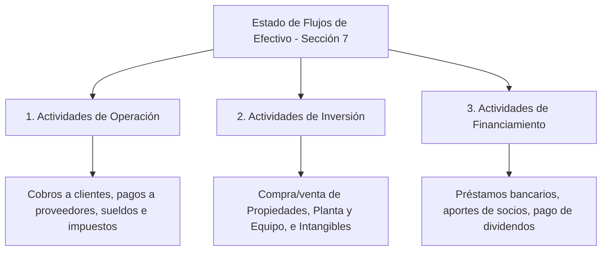
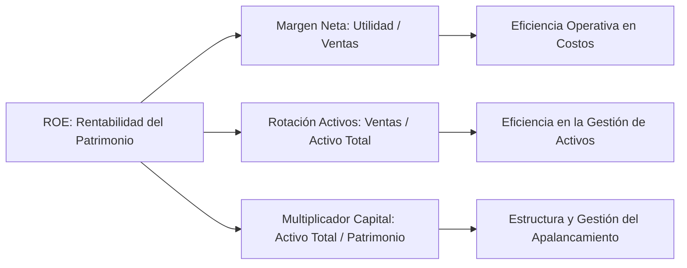

# TRATADO ACADÉMICO: ANÁLISIS DE LA CONTABILIDAD Y DIAGNÓSTICO FINANCIERO
## MÓDULO 10: ANÁLISIS DE LA CONTABILIDAD
**Elaborado por:** MSc. Frank Clemente  
**Cátedra:** Contabilidad Financiera y Finanzas Corporativas  
**Nivel:** Universitario / Posgrado (Diplomado en Contabilidad Financiera)  
**Institución:** Universidad Católica Santa Rosa (UCSAR)  

---

## INTRODUCCIÓN Y FUNDAMENTACIÓN TEÓRICO-FINANCIERA

El análisis contable y financiero representa el proceso crítico mediante el cual se transforman los datos cuantitativos reflejados en los Estados Financieros en **información estratégica para la toma de decisiones gerenciales, la evaluación de la solvencia y la medición del valor económico creado**.

La literatura financiera moderna (**Brealey, Myers & Allen**, *Corporate Finance*; **Lawrence J. Gitman**, *Principios de Administración Financiera*; y la doctrina europea de **Urias Valiente** y **Rivero Torre**) establece que el diagnóstico financiero comprende tres dimensiones interrelacionadas e indisociables:

1. **Análisis Patrimonial y de Estructura (Balance de Situación Financiera):** Evalúa el equilibrio financiero, la independencia patrimonial, la liquidez y la calidad de la masa de activos y pasivos.
2. **Análisis Económico (Estado de Resultados Integral):** Examina la rentabilidad operativa, la eficiencia en la generación de ventas, la estructura de costos y el apalancamiento operativo (punto de equilibrio).
3. **Análisis de Flujos y Rentabilidad (Estado de Flujos de Efectivo, ECPN, ROA/ROE y Modelo DuPont):** Determina la capacidad de generación real de caja limpia, la efectividad en la gestión de activos y el retorno final sobre el capital invertido por los accionistas.

Bajo la normativa **NIIF para las PYMES (Secciones 3, 4, 5, 6, 7 y 11)** y los principios **VEN-NIF (BA VEN-NIF N° 8)**, el análisis contable exige incorporar los efectos del entorno hiperinflacionario o bimonetario mediante la reexpresión de estados financieros y la evaluación en moneda funcional ($BS$ y $USD$).

---

# UNIDAD DIDÁCTICA 1. ANÁLISIS DEL BALANCE (PATRIMONIAL Y FINANCIERO)

El análisis del Balance de Situación Financiera busca determinar si la entidad posee una estructura de recursos limpia, equilibrada y capaz de responder por sus compromisos exigibles en el corto, mediano y largo plazo.

---

## 1. CÁLCULO DE PORCENTAJES (ANÁLISIS VERTICAL Y HORIZONTAL)

### 1.1 Análisis Vertical (Estructural)
El análisis vertical calcula la participación relativa porcentual de cada cuenta u homogéneo de masas patrimoniales respecto al total del Activo o del Pasivo + Patrimonio:

$$\text{Porcentaje Vertical (Activo)} = \left( \frac{\text{Valor de la Cuenta}}{\text{Total Activos}} \right) \times 100$$

$$\text{Porcentaje Vertical (Pasivo/Patrimonio)} = \left( \frac{\text{Valor de la Cuenta}}{\text{Total Pasivo y Patrimonio}} \right) \times 100$$

#### Criterio Doctrinario:
* **Activo Corriente / Activo Total:** Mide el grado de flexibilidad o liquidez del activo.
* **Pasivo Total / Activo Total:** Mide el nivel de endeudamiento global de la entidad.

### 1.2 Análisis Horizontal (Tendencial o Dinámico)
Mide la variación absoluta ($\Delta$) y relativa ($\%$) de una cuenta o rubro financiero entre dos ejercicios económicos consecutivos ($t_0$ y $t_1$):

$$\text{Variación Absoluta } (\Delta) = \text{Monto}_{t_1} - \text{Monto}_{t_0}$$

$$\text{Variación Relativa } (\%) = \left( \frac{\text{Monto}_{t_1} - \text{Monto}_{t_0}}{\text{Monto}_{t_0}} \right) \times 100$$

---

## 2. REPRESENTACIÓN GRÁFICA DEL BALANCE

La representación visual de las masas patrimoniales permite constatar de forma inmediata si existe el **Principio de Fondo de Maniobra Positivo** (Capital de Trabajo Neto):

```text
========================================================================
                      MASAS PATRIMONIALES DEL BALANCE
========================================================================
[  ACTIVO NO CORRIENTE (ANC)  ] | [  PATRIMONIO NETO (PN)            ]
[  Propiedades, Planta y Eq.  ] | [  Capital Social, Reservas, Res. ]
--------------------------------+---------------------------------------
[  ACTIVO CORRIENTE (AC)      ] | [  PASIVO NO CORRIENTE (PNC)       ]
[  Inventarios, Cuentas x Cobr] | [  Deudas Bancarias Largo Plazo   ]
[  Efectivo y Equivalentes    ] +---------------------------------------
                                | [  PASIVO CORRIENTE (PC)          ]
                                | [  Proveedores, Impuestos, Moras  ]
========================================================================
* FONDO DE MANIOBRA (FM) = AC - PC > 0 (Zona de Seguridad Financiera)
```

---

## 3. ESTADO DE ORIGEN Y APLICACIÓN DE FONDOS (EOAF)

El **EOAF** (o Cuadro de Financiación) explica los cambios en la posición financiera de la entidad mediante la distinción entre **Orígenes de Fondos (Fuentes)** y **Aplicaciones de Fondos (Usos)**:

| Naturaleza del Movimiento | Aumento de la Cuenta ($+$) | Disminución de la Cuenta ($-$) |
| :--- | :--- | :--- |
| **Cuenta de Activo** | **APLICACIÓN / USO** (Compra de activo, acumulación de inventario) | **ORIGEN / FUENTE** (Venta de activo, cobro a clientes) |
| **Cuenta de Pasivo** | **ORIGEN / FUENTE** (Obtención de crédito, emisión de deuda) | **APLICACIÓN / USO** (Pago de deudas, amortización) |
| **Cuenta de Patrimonio** | **ORIGEN / FUENTE** (Aporte de capital, utilidades retenidas) | **APLICACIÓN / USO** (Pago de dividendos, pérdidas) |

---

## 4. ESTADO DE FLUJOS DE EFECTIVO (EFE - SECCIÓN 7 NIIF PYME)

El Estado de Flujos de Efectivo clasifica todas las entradas y salidas reales de efectivo y equivalentes en **tres actividades operativas fundamentales**:



### Métodos de Presentación del Flujo de Operación:
1. **Método Directo:** Presenta las clases principales de cobros y pagos brutos en efectivo (Cobros a clientes $-$ Pagos a proveedores y personal).
2. **Método Indirecto:** Parte de la Utilidad/Pérdida Neta del ejercicio y la ajusta por:
   * Partidas no monetarias (Depreciaciones, Amortizaciones, Deterioro).
   * Variaciones en el Capital de Trabajo ($\Delta$ Cuentas por Cobrar, $\Delta$ Inventarios, $\Delta$ Cuentas por Pagar).

---

## 5. ESTADO DE CAMBIOS EN EL PATRIMONIO NETO (ECPN - SECCIÓN 6 NIIF PYME)

El ECPN muestra las variaciones cualitativas y cuantitativas experimentadas en la estructura patrimonial de los propietarios durante el periodo financiero:
* Aportes de capital o aumentos por capitalización de reservas.
* Distribución de dividendos o decretos de reservas legales.
* Ganancias o Pérdidas del ejercicio.
* Ganancias y Pérdidas reconocidas en el Otro Resultado Integral (ORI).

---

## 6. ESTUDIO DE RATIOS FINANCIEROS

Los ratios son coeficientes matemáticos que relacionan dos partidas de los estados financieros para evaluar la salud patrimonial de la entidad.

### A) Ratios de Liquidez

| Ratio | Fórmula de Cálculo | Valor Ideal / Interpretación |
| :--- | :--- | :--- |
| **Razón Corriente (Liquidez General)** | $RC = \frac{\text{Activo Corriente}}{\text{Pasivo Corriente}}$ | **$1,50 - 2,50$**: Indica que la empresa posee entre $1,50$ y $2,50\text{ BS}$ de activo circulante por cada $1,00\text{ BS}$ de deuda exigible a corto plazo. |
| **Prueba Ácida (Liquidez Severa)** | $PA = \frac{\text{Activo Corriente} - \text{Inventarios}}{\text{Pasivo Corriente}}$ | **$1,00 - 1,50$**: Mide la capacidad de respuesta inmediata sin depender de la venta tardía de inventarios. |
| **Liquidez Inmediata (Efectivo)** | $LI = \frac{\text{Efectivo y Equivalentes}}{\text{Pasivo Corriente}}$ | **$0,30 - 0,50$**: Mide la tesorería instantánea disponible en bancos y caja. |

### B) Ratios de Endeudamiento y Solvencia

| Ratio | Fórmula de Cálculo | Interpretación Doctrinal |
| :--- | :--- | :--- |
| **Ratio de Endeudamiento Total** | $ET = \frac{\text{Pasivo Total}}{\text{Activo Total}}$ | Mide el porcentaje de los activos financiados por acreedores externos. Ideal $\le 60\%$. |
| **Apalancamiento Financiero** | $AP = \frac{\text{Pasivo Total}}{\text{Patrimonio Neto}}$ | Mide la proporción de capital ajeno frente al capital propio de los socios. |
| **Autonomía Financiera** | $AF = \frac{\text{Patrimonio Neto}}{\text{Activo Total}}$ | Indica qué porcentaje de los activos pertenece realmente a los accionistas. |

### C) Ratios de Cobro, Pago y Rotación

1. **Rotación de Inventarios:**
   $$\text{Rotación de Inventarios} = \frac{\text{Costo de Ventas}}{\text{Inventario Promedio}}$$

2. **Días Promedio de Inventario (DPI):**
   $$\text{DPI} = \frac{365}{\text{Rotación de Inventarios}}$$

3. **Período Medio de Cobro (PMC / Días de Venta en la Calle):**
   $$\text{PMC} = \left( \frac{\text{Cuentas por Cobrar Promedio}}{\text{Ventas a Crédito Totales}} \right) \times 365$$

4. **Período Medio de Pago (PMP / Días de Crédito con Proveedores):**
   $$\text{PMP} = \left( \frac{\text{Cuentas por Pagar Promedio}}{\text{Compras a Crédito Totales}} \right) \times 365$$

* **Regla de Oro de Gestión Financiera:** El periodo de cobro debe ser menor al periodo de pago ($\text{PMC} < \text{PMP}$) para evitar déficit de tesorería y necesidad de financiamiento costoso.

---

# UNIDAD DIDÁCTICA 2. ANÁLISIS ECONÓMICO (ESTADO DE RESULTADOS)

El análisis económico evalúa la estructura de ingresos, costos y gastos de la entidad para determinar la eficiencia operativa de las ventas y la capacidad de generar margen operativo puro.

---

## 1. CÁLCULO DE PORCENTAJES Y ESTRUCTURA DE LA CUENTA DE RESULTADOS

El análisis vertical en la cuenta de resultados toma como base de referencia ($100\%$) a los **Ingresos Netos por Ventas**:

```text
========================================================================
          ESTRUCTURA PORCENTUAL DEL ESTADO DE RESULTADOS
========================================================================
(+) Ventas Netas Totales ........................... 100,0 %  (Base)
(-) Costo de Ventas ................................ ( 60,0 %)
------------------------------------------------------------------------
(=) MARGEN BRUTO EN VENTAS .........................   40,0 %
(-) Gastos Operativos (Ventas y Administración) .... ( 24,0 %)
------------------------------------------------------------------------
(=) UTILIDAD OPERATIVA (EBIT) ......................   16,0 %
(-) Gastos Financieros (Intereses de Deuda) ........ (  4,0 %)
------------------------------------------------------------------------
(=) UTILIDAD ANTES DE IMPUESTOS (EBT) ..............   12,0 %
(-) Impuesto Sobre la Renta (ISLR) ................. (  3,6 %)
------------------------------------------------------------------------
(=) UTILIDAD NETA DEL EJERCICIO ....................    8,4 %
========================================================================
```

---

## 2. REPRESENTACIÓN GRÁFICA DEL RESULTADO (CASCADA DE RESULTADOS)

La representación en gráfico de cascada visualiza cómo cada nivel de costo absorbe el ingreso monetario generado hasta llegar a la Utilidad Neta del Ejercicio.

---

## 3. TASA DE EXPANSIÓN DE LAS VENTAS (CAGR Y AJUSTE POR INFLACIÓN)

Mide la tasa de crecimiento nominal e interanual de los ingresos operacionales entre dos o más periodos:

$$\text{Tasa de Crecimiento de Ventas } (\%) = \left( \frac{\text{Ventas}_{t_1} - \text{Ventas}_{t_0}}{\text{Ventas}_{t_0}} \right) \times 100$$

### Ajuste por Inflación (VEN-NIF / BA VEN-NIF N° 8):
En entornos con inflación significante, el crecimiento nominal debe deflactarse utilizando el **Índice Nacional de Precios al Consumidor (INPC)** para determinar el Crecimiento Real en Volumen de Ventas:

$$\text{Ventas Reales (Deflactadas)} = \frac{\text{Ventas Nominales}}{\text{INPC}_{t_1} / \text{INPC}_{t_0}}$$

---

## 4. DESTINO DE CADA 100 UNIDADES MONETARIAS (UM) VENDIDAS

Es una herramienta docente de análisis horizontal que desglosa cómo se distribuyen exactamente cada 100 Bolívares o Dólares facturados:

$$\text{UM al Costo de Ventas} = \% \text{ Costo de Ventas} \times 100$$
$$\text{UM a Gastos Operativos} = \% \text{ Gastos Operativos} \times 100$$
$$\text{UM a Gastos Financieros e Impuestos} = \% \text{ Financieros e ISLR} \times 100$$
$$\text{UM a Utilidad Neta} = \% \text{ Utilidad Neta} \times 100$$

---

## 5. ANÁLISIS DE GASTOS Y APALANCAMIENTO OPERATIVO

### 5.1 Clasificación de Gastos:
* **Costos/Gastos Fijos (CFT):** Aquellos que permanecen constantes independientemente del volumen de producción o ventas (alquileres, sueldos administrativos, seguros).
* **Costos/Gastos Variables (CVT):** Aquellos que varían en proporción directa con el nivel de producción y ventas (materia prima, comisiones de ventas, embalajes).

### 5.2 Grado de Apalancamiento Operativo (GAO):
Mide el impacto porcentual en la utilidad operativa (EBIT) ante un cambio en las ventas:

$$\text{GAO} = \frac{\text{Porcentaje Cambio en EBIT}}{\text{Porcentaje Cambio en Ventas}} = \frac{Q \times (\text{PVU} - \text{CVU})}{Q \times (\text{PVU} - \text{CVU}) - \text{CFT}}$$

---

## 6. PUNTO DE EQUILIBRIO OPERATIVO (BREAK-EVEN POINT)

El Punto de Equilibrio es el nivel de ventas (en unidades físicas o bolívares) en el cual los ingresos totales igualan exactamente a los costos totales, obteniendo una Utilidad Operativa igual a cero ($\text{EBIT} = 0$).

### 6.1 Margen de Contribución Unitario (MCU):
$$\text{MCU} = \text{PVU} - \text{CVU}$$

### 6.2 Ratio de Margen de Contribución ($m$):
$$m = \frac{\text{MCU}}{\text{PVU}} = \frac{\text{PVU} - \text{CVU}}{\text{PVU}}$$

### 6.3 Fórmulas del Punto de Equilibrio:

1. **Punto de Equilibrio en Unidades físicas ($Q_e$):**
   $$Q_e = \frac{\text{Costos Fijos Totales (CFT)}}{\text{Margen de Contribución Unitario (MCU)}} = \frac{\text{CFT}}{\text{PVU} - \text{CVU}}$$

2. **Punto de Equilibrio en Monto Monetario ($V_e$):**
   $$V_e = \frac{\text{Costos Fijos Totales (CFT)}}{m} = Q_e \times \text{PVU}$$

---

# UNIDAD DIDÁCTICA 3. ANÁLISIS DE LA RENTABILIDAD (ROA, ROE Y DUPONT)

La rentabilidad mide la capacidad de la entidad para generar beneficios en relación con los recursos invertidos.

---

## 1. RENDIMIENTO DEL ACTIVO (ROA - RETURN ON ASSETS)

### 1.1 Definición e Interpretación
El **ROA** (también conocido como *Rentabilidad Económica* o *ROI*) mide la eficiencia operativa con la que la gerencia utiliza el **conjunto total de activos** de la empresa para generar utilidades, independientemente de cómo hayan sido financiados (deuda o capital propio).

$$\text{ROA} = \frac{\text{Utilidad Neta}}{\text{Activo Total Promedio}}$$

*(En análisis puro operativo se utiliza el EBIT en el numerador: $\text{ROA Operativo} = \frac{\text{EBIT}}{\text{Activo Total}}$).*

---

## 2. RENTABILIDAD DEL PATRIMONIO NETO (ROE - RETURN ON EQUITY)

### 2.1 Definición e Interpretación
El **ROE** (o *Rentabilidad Financiera*) mide la tasa de retorno o ganancia neta generada exclusivamente sobre la **inversión de los accionistas o propietarios** de la entidad.

$$\text{ROE} = \frac{\text{Utilidad Neta}}{\text{Patrimonio Neto Promedio}}$$

---

## 3. DESCOMPOSICIÓN DEL MODELO DUPONT

El Modelo DuPont descompone el ROE en tres palancas financieras fundamentales: **Margen de Utilidad, Rotación de Activos y Apalancamiento Financiero**:

$$\text{ROE} = \left( \frac{\text{Utilidad Neta}}{\text{Ventas}} \right) \times \left( \frac{\text{Ventas}}{\text{Activo Total}} \right) \times \left( \frac{\text{Activo Total}}{\text{Patrimonio Neto}} \right)$$

$$\mathbf{\text{ROE}} = \mathbf{\text{Margen Neta}} \times \mathbf{\text{Rotación de Activos}} \times \mathbf{\text{Multiplicador del Capital (Apalancamiento)}}$$



---

# CUADRO SÍNTESIS COMPARATIVO DE RATIOS E INDICADORES CLAVE

| Indicador Financiero | Fórmula | Valor Objetivo | Dimensión de Evaluación |
| :--- | :--- | :--- | :--- |
| **Razón Corriente** | $\frac{\text{Activo Corriente}}{\text{Pasivo Corriente}}$ | $1,50 - 2,50$ | Liquidez General a Corto Plazo |
| **Prueba Ácida** | $\frac{\text{Activo Corriente} - \text{Inventario}}{\text{Pasivo Corriente}}$ | $1,00 - 1,50$ | Liquidez Severa Inmediata |
| **Ratio de Endeudamiento** | $\frac{\text{Pasivo Total}}{\text{Activo Total}}$ | $\le 60\%$ | Solvencia y Estructura de Capital |
| **Período Medio de Cobro (PMC)**| $\left( \frac{\text{Cuentas x Cobrar}}{\text{Ventas Crédito}} \right) \times 365$ | $< \text{PMP}$ | Eficiencia de Cobranza |
| **Punto de Equilibrio ($Q_e$)** | $\frac{\text{CFT}}{\text{PVU} - \text{CVU}}$ | Cobertura $100\%$ Costos | Umbral de Operación Sin Pérdidas |
| **ROA (Return on Assets)** | $\frac{\text{Utilidad Neta}}{\text{Activo Total}}$ | $> 10\%$ | Eficiencia de la Inversión en Activos |
| **ROE (Return on Equity)** | $\frac{\text{Utilidad Neta}}{\text{Patrimonio Neto}}$ | $> \text{Costo de Capital (WACC)}$ | Rendimiento para los Accionistas |

---

## BIBLIOGRAFÍA Y FUENTES DOCTRINALES
1. **Brealey, Richard A., Myers, Stewart C., & Allen, Franklin.** *Principios de Finanzas Corporativas*. McGraw-Hill, Madrid.
2. **Gitman, Lawrence J., & Zutter, Chad J.** *Principios de Administración Financiera*. Pearson Educación, México.
3. **Urias Valiente, Jesús.** *Análisis de Estados Financieros*. Ediciones Pirámide, Madrid.
4. **Rivero Torre, Pedro.** *Análisis del Balance de Situación*. Editorial Trimestre Económico, Madrid.
5. **IASB.** *Norma Internacional de Información Financiera para Pequeñas y Medianas Entidades (NIIF para las PYMES)*. Secciones 3, 4, 5, 6 y 7.
6. **FCCPV.** *Boletín de Aplicación VEN-NIF N° 8 (BA VEN-NIF 8)*. Principios de Contabilidad Generalmente Aceptados en Venezuela.
